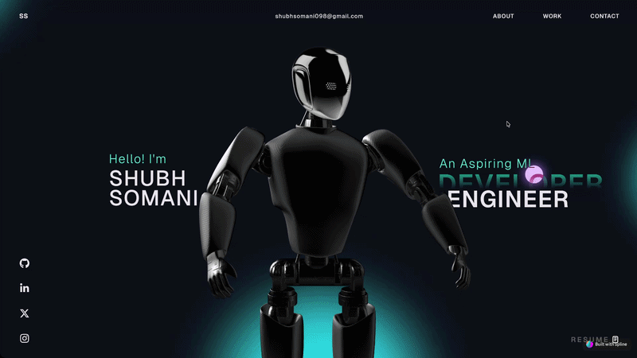

# 🚀 Shubh Somani's Portfolio Website

An interactive and visually stunning portfolio website built with cutting-edge web technologies, featuring 3D animations, smooth scrolling effects, and responsive design.

## 🌐 Live Site

**Visit my portfolio:** [portfolio.shubhtestingthings.uk](https://portfolio.shubhtestingthings.uk)

*Self-hosted on a home browser with reverse proxy for public access*

## 📋 About

This portfolio showcases my work as an aspiring **ML Engineer & Developer**. It features:
- 🎨 Interactive 3D character models with WebGL
- ✨ Smooth scroll animations and transitions
- 💼 Project showcases and case studies
- 📝 Professional career timeline
- 🔗 Social media integration
- 📱 Fully responsive design

## 🛠️ Tech Stack

### Frontend Framework
- **React 18** - UI library for building interactive components
- **TypeScript** - Type-safe JavaScript for better code quality
- **Vite** - Next-generation frontend build tool for fast development

### 3D & Graphics
- **Three.js** - 3D JavaScript library for WebGL rendering
- **React Three Fiber** - React renderer for Three.js
- **React Three Drei** - Useful helpers and abstractions for React Three Fiber
- **React Three Postprocessing** - Post-processing effects for Three.js
- **Spline** - 3D design and animation platform integration

### Animation & Interaction
- **GSAP (GreenSock)** - Professional-grade animation library
- **GSAP React** - React integration for GSAP
- **React Fast Marquee** - Marquee animation component

### UI & Utilities
- **React Icons** - Popular icon library
- **React Three Cannon & Rapier** - Physics simulation for 3D objects
- **Vercel Analytics** - Website analytics

### Styling
- CSS3 with custom animations
- Responsive design practices

## � License

This project is open source and available under the [MIT License](LICENSE).
